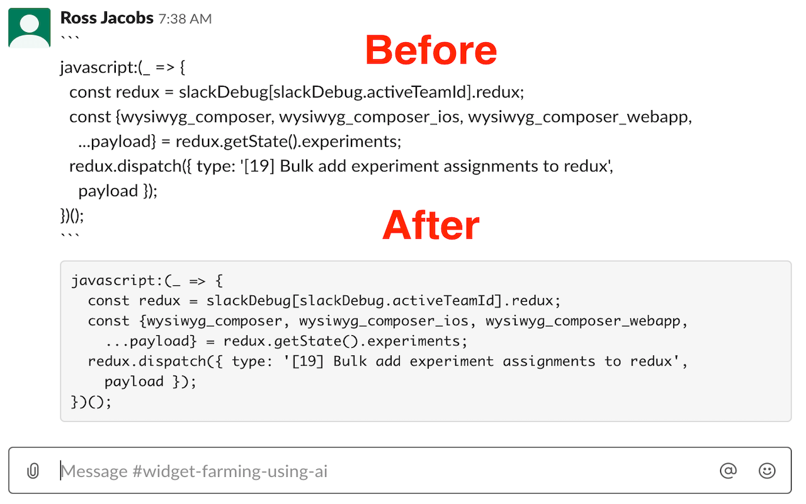

# No-WYSIWYG

Disables Slack's new wysiwyg text editor. Based on Kevin Fahy's script that allows users to [disable the new wysiwyg editor](https://github.com/kfahy/slack-disable-wysiwyg-bookmarklet).

## Background

Slack used to have the ability to use markdown in their text. They changed this permanently for all users without the ability to go back. Per Arthur O’Dwyer on his blog entry that was posted on [Hacker News](https://quuxplusone.github.io/blog/2019/11/20/slack-rich-text-box/) on 2019-11-20):

> Slack has just recently rolled out a “WYSIWYG text input” widget to its Web browser interface. (Apparently, the phased rollout started at the beginning of November 2019, but it’s just now starting to hit the workspaces that I participate in.) The user experience of using this new input method is really, really, really bad.

Inspired by the 2 Hacker News articles today: https://news.ycombinator.com/item?id=21589647, https://github.com/kfahy/slack-disable-wysiwyg-bookmarklet

## Installation

Official extensions have been registered:

* Firefox: https://addons.mozilla.org/en-US/firefox/addon/disable-slack-wysiwyg/
* Chrome: https://chrome.google.com/webstore/detail/jenojkbpialbgpbgokiakifhpmoponjn

To install locally to your machine, check out [releases](https://github.com/pocc/no-wysiwyg/releases).

## License

Apache 2.0
